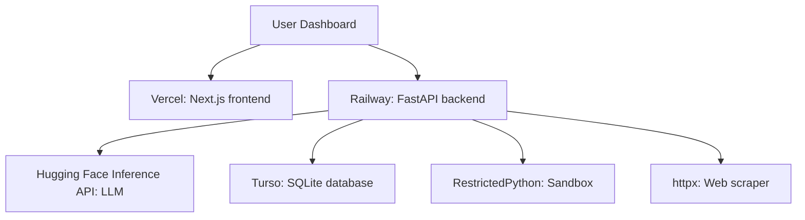

# Helix

Helix is an autonomous agent system designed for recursive web task solving. It processes URLs, extracts content, and delegates decision-making to a language model to answer questions or fulfill objectives. The system runs in a restricted Python sandbox to execute dynamically generated code safely.

## Architecture



## Tech Stack

| Layer | Technology |
| :--- | :--- |
| Frontend | Next.js |
| Backend | FastAPI |
| Database | Turso |
| Inference | Hugging Face |
| Sandbox | RestrictedPython |

## Local Development

```bash
git clone https://github.com/Kunal-Somani/helix-agent.git
cd helix-agent
cp .env.example .env
# Fill .env with your values
docker compose up
```

## Live Links

- Frontend: https://helix-app.vercel.app
- API Docs: https://helix-api.up.railway.app/api/docs

## API Reference

| Method | Endpoint | Auth | Description |
| :--- | :--- | :--- | :--- |
| GET | `/health` | None | System health check |
| GET | `/api/quiz/runs` | None | List historical runs |
| GET | `/api/quiz/runs/{id}` | None | Retrieve specific run |
| POST | `/api/quiz/run` | Bearer | Enqueue a new run |
| GET | `/api/quiz/status/{id}` | Bearer | Get status of an active run |
| GET | `/api/quiz/runs/{id}/logs` | None | Stream execution logs |
| GET | `/api/metrics/performance` | None | System performance metrics |

## Environment Variables

| Variable | Description |
| :--- | :--- |
| `HF_API_TOKEN` | Hugging Face token |
| `TURSO_DATABASE_URL` | Turso database URL |
| `TURSO_AUTH_TOKEN` | Turso auth token |
| `FRONTEND_URL` | Allowed CORS origin |
| `MY_EMAIL` | Administrator email |
| `MY_SECRET` | Auth secret key |
| `LOG_LEVEL` | Application log level |
| `ENVIRONMENT` | Target environment |

## License

MIT
