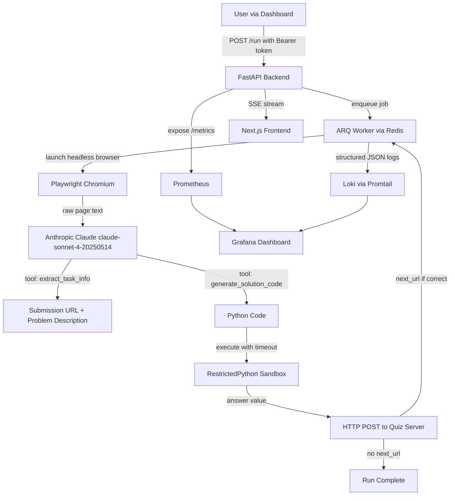

# LLM Quiz Solver

An autonomous agent that takes a URL, reads the quiz page using a headless browser, calls Claude claude-sonnet-4-20250514 to extract the problem and generate a Python solution, executes that code in an isolated sandbox, submits the answer, and follows the chain to the next task if one exists. The loop runs without human input until a terminal state is reached.

Built as a production-grade showcase of agentic AI systems for the IITM Tools in Data Science curriculum.

---

## Architecture



The workflow follows the OODA loop: Playwright **observes** the page, Claude **orients** by extracting the task structure, Claude **decides** by generating solution code, and the sandbox plus HTTP submit form the **act** step. On a correct answer the loop restarts at the next URL.

---

## Tech Stack

| Layer | Technology | Reason |
| :--- | :--- | :--- |
| API | FastAPI + uvicorn | Async-first, automatic OpenAPI docs, native SSE support |
| Task Queue | ARQ on Redis | Async-native, persistent jobs, built-in retry and timeout |
| AI Engine | Anthropic Claude claude-sonnet-4-20250514 via official SDK | Structured tool use outputs, no regex parsing needed |
| Browser Automation | Playwright Chromium headless | Handles JS-rendered pages and networkidle state |
| Code Execution | RestrictedPython + SIGALRM | Safe eval with timeout, blocks filesystem and network access |
| Observability | Prometheus + Loki + Grafana | Metrics, logs, and dashboards in one stack |
| Frontend | Next.js 14 App Router + shadcn/ui + TanStack Query | Server components, auto-polling run status, dark mode |
| Containerization | Docker multi-stage builds | Separate backend, worker, and frontend containers |

---

## Running Locally

**Prerequisites:** Docker Desktop and a `.env` file with valid credentials.

```bash
git clone https://github.com/Kunal-Somani/llm-quiz-solver.git
cd llm-quiz-solver
cp .env.example .env
# Fill in ANTHROPIC_API_KEY and MY_SECRET in .env
docker compose up --build
```

| Service | URL |
| :--- | :--- |
| Dashboard | <http://localhost:3000> |
| API docs | <http://localhost:8000/docs> |
| Grafana | <http://localhost:3001> (admin / admin) |
| Prometheus | <http://localhost:9090> |

---

## API Reference

| Method | Endpoint | Auth | Description |
| :--- | :--- | :--- | :--- |
| POST | /run | Bearer token | Enqueue a new quiz run |
| GET | /runs | None | List all runs with status |
| GET | /runs/{id} | None | Get a single run with full iteration history |
| GET | /runs/{id}/logs | None | SSE stream of live run logs |
| GET | /health | None | Health check with model name and version |
| GET | /metrics | None | Prometheus metrics endpoint |

---

## Environment Variables

| Variable | Required | Description |
| :--- | :--- | :--- |
| ANTHROPIC_API_KEY | Yes | API key from console.anthropic.com |
| MY_EMAIL | Yes | Email submitted with each quiz answer |
| MY_SECRET | Yes | Bearer token for POST /run authentication |
| REDIS_URL | No | Redis connection string (default: redis://redis:6379) |
| LOG_LEVEL | No | Logging verbosity (default: INFO) |
| ENVIRONMENT | No | Used as a Prometheus label (default: development) |
